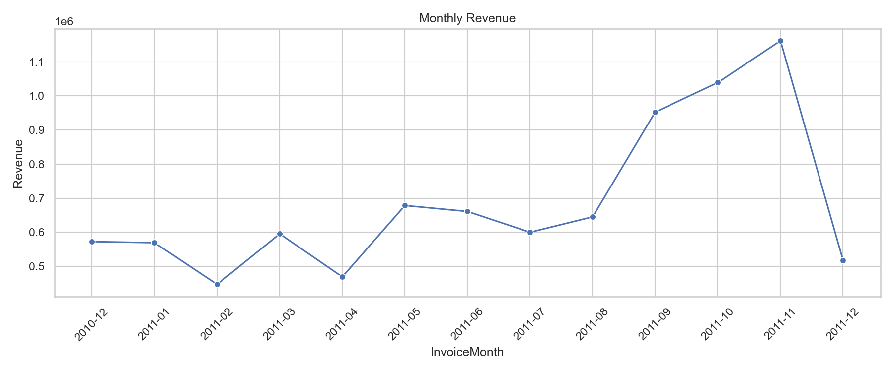
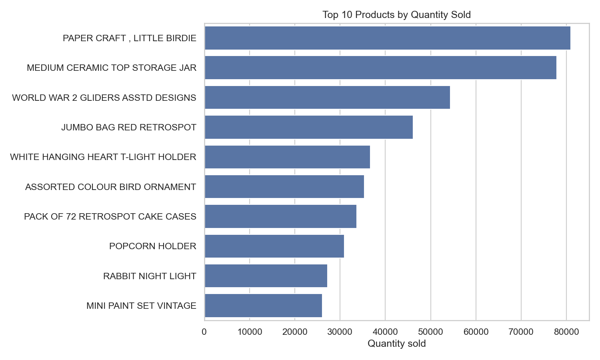
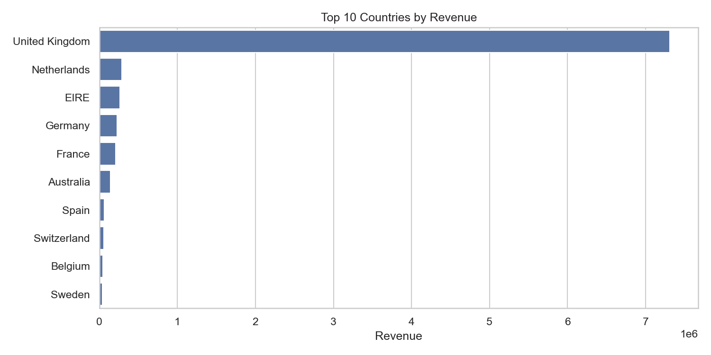
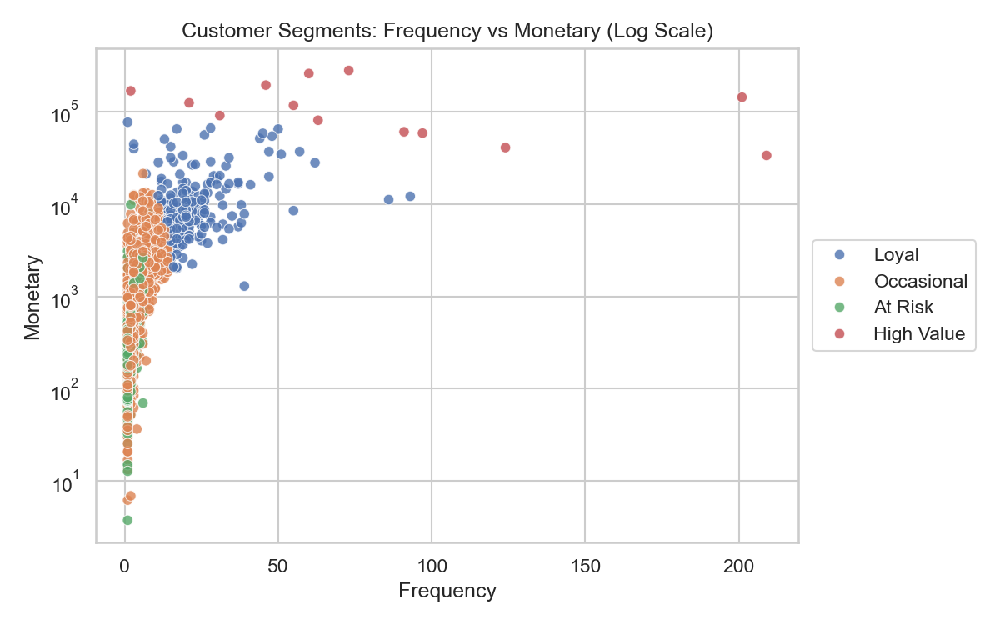
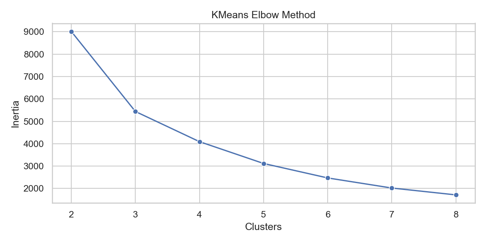

# Retail Insight: Customer Purchase Analysis

Customer purchase analysis project based on transactional retail data from an online retail store. The goal is to clean and process raw sales records, explore purchasing patterns, segment customers with RFM analysis and KMeans, and build a simple baseline classifier for high-value customers.

## Tech Stack

- Python
- NumPy
- pandas
- scikit-learn
- matplotlib
- seaborn
- Jupyter Notebook

## Dataset

This project uses the Online Retail Dataset from the UCI Machine Learning Repository. The dataset contains transactions for a UK-based online retail store from 2010-12-01 to 2011-12-09.

Place the raw file here:

```text
data/Online Retail.xlsx
```

The raw data file is ignored by Git to keep the public repository lightweight.

## Project Structure

```text
customer-purchase-analysis/
|-- data/
|   |-- README.md
|   `-- Online Retail.xlsx
|-- notebooks/
|   `-- 01_customer_purchase_analysis.ipynb
|-- outputs/
|   |-- figures/
|   `-- reports/
|-- src/
|   |-- __init__.py
|   |-- analysis.py
|   |-- data_processing.py
|   |-- modeling.py
|   `-- segmentation.py
|-- LICENSE
|-- README.md
`-- requirements.txt
```

## Workflow

1. Load the Excel dataset.
2. Clean the transaction table:
   - remove cancelled invoices,
   - remove missing customer IDs,
   - remove invalid quantities and prices,
   - create `TotalPrice`,
   - convert invoice dates.
3. Explore customer and sales behavior:
   - monthly revenue,
   - top-selling products,
   - revenue by country,
   - average order value,
   - returning customer share.
4. Build RFM customer features:
   - Recency,
   - Frequency,
   - Monetary value.
5. Segment customers with KMeans.
6. Train simple baseline classifiers for the `High Value` customer segment.

## Key Findings

- Revenue peaked in November 2011 at about 1.16M, suggesting strong seasonal demand before the holiday period.
- December 2011 should not be interpreted as a full-month decline because the dataset ends on 2011-12-09.
- The United Kingdom dominates total revenue with about 7.31M, far ahead of the Netherlands, EIRE, Germany and France.
- The most frequently sold products are not always the highest revenue drivers, which shows the difference between product popularity and monetary impact.
- RFM segmentation identified four customer groups: `High Value`, `Loyal`, `Occasional` and `At Risk`.
- A very small `High Value` group contains only 13 customers, but has the highest average monetary value by a large margin.

## Visualizations

### Monthly Revenue



### Top Products by Quantity Sold



### Revenue by Country



### Customer Segments

The log-scale version makes customer segments easier to compare because a few very high-value customers strongly stretch the regular monetary axis.



### KMeans Elbow Method



## Customer Segments

| Segment | Customers | Avg Recency | Avg Frequency | Avg Monetary | Avg Order Value |
|---|---:|---:|---:|---:|---:|
| High Value | 13 | 7.38 | 82.54 | 127,338.31 | 8,570.73 |
| Loyal | 204 | 15.50 | 22.33 | 12,709.09 | 1,080.41 |
| Occasional | 3,054 | 43.70 | 3.68 | 1,359.05 | 376.76 |
| At Risk | 1,067 | 248.08 | 1.55 | 480.62 | 314.81 |

## Machine Learning

The project includes a lightweight classification task: predicting whether a customer belongs to the `High Value` segment based on RFM-derived features. This is used as a simple scikit-learn demonstration rather than a production-ready predictive model, because the target label is derived from the segmentation step.

Implemented models:

- Logistic Regression
- Random Forest Classifier

Evaluation includes:

- accuracy,
- precision,
- recall,
- F1-score,
- confusion matrix.

## How To Run

Create and activate a virtual environment:

```bash
python -m venv .venv
.venv\Scripts\activate
```

Or use conda:

```bash
conda create -n customer-purchase-analysis python=3.11
conda activate customer-purchase-analysis
```

Install dependencies:

```bash
pip install -r requirements.txt
```

Open the notebook:

```bash
jupyter notebook notebooks/01_customer_purchase_analysis.ipynb
```
